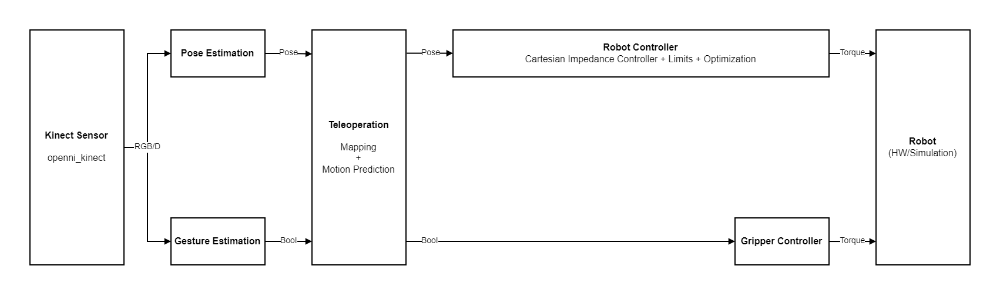

# teleop_grasp
Compliant teleoperation and gesture-controlled grasping using DNN pose- and gesture estimation in ROS.

* [Overview](#overview)
* [Installation](#installation)
* [Usage](#usage)
	+ [Running the project](#running-the-project)
	+ [Experiments](#experiments)
	+ [Configuration (VS Code)](#configuration-vs-code)
	+ [Guidelines](#guidelines)
* [License](#license)
* [Acknowledgments](#acknowledgments)

## Overview

The objective is to develop a system in which a collaborative robot (cobot) with an attached gripper is able to mimic (track) the pose (position and orientation) of an operator’s hand, in which the gripper state (closed/open) is controlled by a hand gesture. The hand pose and gesture are captured by a camera and inferred using DNN. The cobot must be compliant, such that it can safely interact with participants; the goal is to lift the wrist of a participant via teleoperation, unless the participant resists.



The project is composed of several project-specific and external ROS packages, as well as other dependencies.

<details>
<summary><strong>Packages</strong></summary></br>

| Package         | Description                                                        |
|-----------------|--------------------------------------------------------------------|
|  `teleop_grasp` | Integration of packages to provide a teleoperation/grasp pipeline. |
| `arm_pose_est`  | Estimation of human arm pose using DNN.                            |
| `gesture_est`   | Estimation of gesture of human hand.                               |
| `franka_ros`    | Integration of Franka Panda into ROS/Gazebo.                       |
| `ros_utils`     | Collection of modern utilities for the ROS/Gazebo/MoveIt workflow. |
| `ros_testing`   | Simple framework for experiments in ROS.                           |
| `qp_oases`      |                                                                    |

For more information, please refer to the `README.md` of a specific package.

</details>

<details>
<summary><strong>Dependencies</strong></summary></br>

* [ROS (noetic)][ros] - framework for robot operation
* [Gazebo][gazebo] - robot simulation environment
* [rosdep] - management of ROS system dependecies
* [vcstool] - automated workspace configuration
* [catkin_tools] - command line tools for working with catkin workspaces

</details>

## Installation

The project is tested on Ubuntu `20.04.3 LTS`. Built using [`catkin_tools`][catkin_tools] with `CMake 3.4` and `gcc 9.3.0-17`.

<details>
<summary><strong>Installing ROS and dependencies</strong></summary></br>

1) Install ROS (Desktop-Full Install) and `rosdep` ([guide](http://wiki.ros.org/noetic/Installation/Ubuntu))
2) Install `vcstool` ([guide](https://github.com/dirk-thomas/vcstool#how-to-install-vcstool))
```
sudo apt install python3-vcstool
```
3) Install `catkin_tools` ([guide](https://catkin-tools.readthedocs.io/en/latest/installing.html#installing-on-ubuntu-with-apt-get))
```
sudo apt install python3-catkin-tools
```
4) Make sure you have Git SSH configured properly as per [this guide](https://docs.github.com/en/github/authenticating-to-github/connecting-to-github-with-ssh).

</details>

<details>
<summary><strong>Installing project (workspace)</strong></summary></br>

Navigate to where the workspace should be created (e.g. `~/Desktop`) and run:

```
wget --no-check-certificate --content-disposition https://github.com/teleop-grasp/teleop_grasp/raw/main/setup.bash && chmod +x setup.bash && source setup.bash
```
<!-- 
If the above doesn't work, then download [`setup.bash`](https://github.com/martinandrovich/rovi_system/raw/main/setup.bash) (← right click and save as) to where the workspace should be created. Open a terminal, navigate to the file, make it executable with `chmod +x setup.bash`, and execute the file in the current shell as `source setup.bash`. -->

</details>

## Usage

### Running the project

Navigate to the `teleop_ws` workspace (or run `teleop_ws` in terminal). The `teleop_ws` command will automatically source the workspace and navigate to its directory.

**Build the workspace** using:

```
catkin build
catkin build_compile_cmd # only if using clangd extension
```

Then, source the environment variables by running `source devel/setup.bash`. 

**Launch the workcell** by running (after sourcing):

```
roslaunch teleop_grasp workcell.launch # NOT WORKING YET!!!
```

An overview of the arguments is located in the [`workcell.launch`](teleop_grasp/launch/workcell.launch) file.

### Experiments

Experiments in `teleop_grasp` are contained in the `teleop_grasp/tests/` directory. An experiment of `<name>` can be implemented in either C++ or Python, and is structured as:

<details>
<summary><strong>Structure of an experiment in <code>teleop_grasp</code></strong></summary></br>

```
teleop_grasp/tests/                 # directory for all experiments in teleop_grasp
|
└── <name>/                        # experiment directory
    |
    ├── img/                       # exported plots
    ├── data/                      # directory with time-stamped trials
    |   ├── 20210105_000322/      
    |   └── ...
    |
    ├── test_<name>.cpp            # source code for experiment (ROS node named test_<name>)
    ├── test_<name>.py             # python code for experiment
    ├── test_<name>.launch         # launch file for experiment
    ├── test_<name>.m              # MATLAB code for data manipulation/plotting using export_fig
    └── README.md                  # documentation of experiment
```
</details>

A C++ experiment is automatically added as a ROS node named `test_<name>` (by `teleop_grasp/CMakeLists.txt`) and can be launched using `rosrun` or `roslaunch` (if provided). Use `teleop_grasp.h` and `scripts/teleop_grasp.m` for helper functions (get experiment/data/img directory, plotting etc.) - see the [`template` experiment](/teleop_grasp/tests/template) for example code.

### Configuration (VS Code)

Since IntelliSense is utter trash for larger projects, it is recommended to use the [`clangd` extension](https://marketplace.visualstudio.com/items?itemName=llvm-vs-code-extensions.vscode-clangd) as the language server, together with [`catkin-tools-clangd`](https://pypi.org/project/catkin-tools-clangd/) python package to generate the `compile_commands.json` for `clangd`.

The [`ROS` extension](https://marketplace.visualstudio.com/items?itemName=ms-iot.vscode-ros) is also a nice addition when working in VS Code. However, the `cpp_properties.json` file it generates for IntellSense is bugged; change the line `/usr/ros/noetic/**` to `/usr/ros/noetic/` to fix include problems.

### Guidelines

The coding conventions are defined by the `.clangformat` (TODO), summarized as:

<details>
<summary><strong>Coding conventions</code></strong></summary></br>

- Indent with tabs, align with spaces
- Comments in lower-case, add URLs to external resources
- Consistent interfaces accross the project (e.g. args and return values)
- Always review the code and examples of a package before adding new code
- Examples of methods/classes etc. is a must (in `/examples`)
- Commit in blocks of relevant code with short and descriptive messages (typically all lower-case)
- Proper includes, cmake and package manifest
- Segregate code properly in packages; generic utilities go in `ros_utils` pkg
- [ROS Best Practices](https://github.com/leggedrobotics/ros_best_practices/wiki)
</details>

## License

No license has been decided yet.

## Acknowledgments

Thanks to SDU for moral support.

<!-- LINKS -->

[semver]: http://semver.org/
[releases]: about:blank
[changelog]: CHANGELOG.md
[wiki]: about:blank

[ros]: http://wiki.ros.org/noetic
[gazebo]: http://gazebosim.org
[rosdep]: https://wiki.ros.org/rosdep
[vcstool]: https://github.com/dirk-thomas/vcstool
[catkin_tools]: https://catkin-tools.readthedocs.io
[export_fig]: https://se.mathworks.com/matlabcentral/fileexchange/23629-export_fig
[Ghostscript]: https://ghostscript.com/index.html
